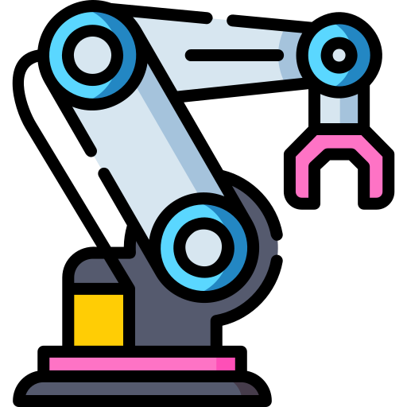

<h1 align="center">Gesture Controlled Robotic Arm</h1>

<p align="center">
  
</p>

<details>
  <summary><h2>📚 Table of Contents (Click to Expand)</h2></summary>

- [📖 Project Description](#-project-description)
- [✨ Features](#-features)
- [⚙️ Installation Instructions](#️-installation-instructions)
- [🦾 Project Showcase](#-project-showcase)
- [🔧 Use Cases](#-use-cases)
- [🛣️ Future Plans](#️-future-plans)
- [🤝 Contributing](#-contributing)
- [📜 License](#-license)
- [🙏 Acknowledgments](#-acknowledgments)
  - [🤖 Meet the Team! 🤝](#-meet-the-team-)
- [📧 Contact Information](#-contact-information)
- [📝 Attribution](#-attribution)
</details>

---

## 📖 Project Description  

The **Gesture-Controlled Robotic Arm** is designed to automate repetitive tasks using hand gestures. The robotic arm consists of **four links**: a **base, two links, and an end effector**, enabling **pick-and-place functionality**.  

Control is achieved via a **glove-based gesture system**, equipped with **flex sensors and an accelerometer**, translating hand movements into precise robotic commands.

---

## ✨ Features  

🤖 4-Link Robotic Arm Structure
    ➤ Enables precise and flexible movement

🖐️ Gesture-Based Control
    ➤ Uses flex sensors and an accelerometer for intuitive interaction

📦 Pick-and-Place Functionality
    ➤ Automates repetitive tasks with ease

🧭 Intuitive User Interface
    ➤ Offers seamless and user-friendly control 

> **Note:**  
> The integration of a 4th link between the end effector and the robotic arm is part of our planned system expansion.  
> In the current release, the design has been optimized for stability, ease of control, and project timelines.  
> Full 4-link integration, offering enhanced dexterity and extended functionality, is scheduled for future updates.  
> Further design considerations and future rollout details are outlined in the [DESIGN.MD](./designs/DESIGN.MD) file.
---

## ⚙️ Installation Instructions  

- 🛠️ For installation instructions and to download the Arduino IDE, visit the [Arduino IDE Download Page](https://www.arduino.cc/en/software).
- Add the ESP32 Library to the ide [Instructions](https://docs.espressif.com/projects/arduino-esp32/en/latest/installing.html)
- To set up the project, follow these steps: 
- Clone the repository:
- ```bash
  git clone https://github.com/Robo-Linkers/Gesture-controlled-robotic-arm.git 
  ```
- Install any necessary dependencies [REQUIREMENTS](requirements.txt)
- Navigate to the project directory:
- ```cd Gesture-controlled-robotic-arm```
- In the `src` folder, you will find two Arduino code files: `Glove.ino` and `Power_Drive.ino`.
  - Upload `Glove.ino` to the ESP32 board that handles gesture recognition.
  - Upload `Power_Drive.ino` to the ESP32 board that controls the robotic arm's movements.
- Before uploading the codes to the boards, make sure to:
  - Edit the relevant fields in both files:
    - Set your WiFi SSID and Password in the code.  
    - Adjust any other parameters as necessary for your setup (e.g., GPIO pins, motor controls).

Once you've uploaded both codes to the respective boards, your setup should be ready for further testing.
- For building the hardware and assembling the robotic arm, refer to the detailed setup and wiring instructions in the [DESIGN.MD](./designs/DESIGN.MD) file. This includes schematics, PCB & hardware designs, and wiring connections necessary to physically construct the system.
-  All Markdown files are available as HTML in the [docs/](./docs) section — check it out for easy browsing and reference.
-  [README.HTML](https://html-preview.github.io/?url=https://github.com/Robo-Linkers/Gesture-controlled-robotic-arm/blob/main/docs/README.html), [DESIGN.HTML](https://html-preview.github.io/?url=https://github.com/Robo-Linkers/Gesture-controlled-robotic-arm/blob/main/docs/DESIGN.html), [TESTS.HTML](https://html-preview.github.io/?url=https://github.com/Robo-Linkers/Gesture-controlled-robotic-arm/blob/main/docs/TESTS.html), [BOM.HTML](https://html-preview.github.io/?url=https://github.com/Robo-Linkers/Gesture-controlled-robotic-arm/blob/main/docs/BOM.html)
---

## 🚀 Usage Instructions  
- After setting up the hardware and software, wear the glove equipped with sensors, power on the robotic arm, and start performing gestures to control its movements.
  ### Components
  - Robotic Arm: 4-link structure with servos.
  - Glove Interface: Equipped with flex sensors and an accelerometer
  - Microcontroller: ESP32 or compatible board for processing input signals
  - Power Supply: AC power source for operation.
  ### Designs
  - For detailed information on the setup, schematics, and design documents related to the glove and robotic arm, refer to the Design Folder. It includes all the necessary diagrams and documentation to help you build the physical system and understand the circuitry.
  ### Testing
  - The tests folder contains Arduino sketches for testing individual components, including:
    - Flex sensors
    - Dual MPU6050
    - Power electronics (motors, servos)
  - If you encounter any errors, test each component individually to identify the source of the issue. 
  > It is **highly recommended** to test each component individually before full assembly to ensure everything is working correctly and to avoid complications during the final integration.

---

## 📂 Folder Structure  
```bash
Gesture-controlled-robotic-arm/
│   .gitignore
│   CONTRIBUTING.md
│   LICENSE
│   README.md
│   requirements.txt
│   TODO.MD
│   
├───assets
│   ├───icons
│   │       3-dof-arm.png
│   │       bill.png
│   │       binary-code.png
│   │       docs.png
│   │       pcb-board.png
│   │       schematic.png
│   │       testing.png
│   │
│   └───images
│           feature-excluded.png
│           mechanical-assembly-ss-front.png
│           mechanical-assembly-ss.png
│           Screenshot 2025-02-11 091135.png
│           Screenshot 2025-02-11 091319.png
│
├───designs
│   │   BASE v14.step
│   │   Bill_of_Materials_Electrical.pdf
│   │   BOM.MD
│   │   DESIGN.MD
│   │   Schematic_Glove-Gesture-Controlled-Robotic-Arm_2025-04-26.pdf
│   │   Schematic_Power-Drive-Gesture-Controlled-Robotic-Arm_2025-04-26.pdf
│   │
│   └───Solid-edge
│           BASE-v14-solid-edge.asm
│           BASE-v14-solid-edge.cfg
│
├───docs
├───logs
│       glove_control.log
│       power_drive.log
│
├───src
│       Glove.ino
│       Power_Drive.ino
│
├───tests
│   │   TESTS.MD
│   │
│   ├───Embedded Systems
│   │   ├───COMPLETE
│   │   │       COMPLETE.ino
│   │   │
│   │   ├───DUAL-MPU6050
│   │   │       DUAL-MPU6050.ino
│   │   │
│   │   └───FLEX-SENSORS
│   │           FLEX-SENSORS.ino
│   │
│   └───Power Electronics
│       ├───complete
│       │       complete.ino
│       │
│       ├───complete-dynamic
│       │       complete-dynamic.ino
│       │
│       ├───nema_17_test
│       │       nema_17_test.ino
│       │
│       └───servo_test
│               servo_test.ino
.
```
---

## 🦾 Project Showcase
<!-- Add vids, images etc -->

---

## 🔧 Use Cases  

💡 **Manufacturing** → Automating repetitive tasks like assembly & packaging  
🔧 **Remote Operation in Hazardous Environments** → Safely handling objects in high-risk areas such as labs or hot zones using remote gesture control
🎓 **Education** → Demonstrating robotics concepts in academic settings  
🧪 **Research** → Exploring human-robot interaction and automation  

---

## 🛣️ Future Plans
- 🚀 **Integrate the 4th Link**
  - Expand the robotic arm with a fourth link between the end effector and arm base to improve dexterity and range of motion.

- 🚀 **Enhance Gesture Recognition**
  - Implement advanced gesture processing algorithms for more fluid and natural control.

- 🚀 **Wireless Communication Optimization**
  - Improve reliability and response time of the ESP32-based communication system.

- 🚀 **Battery Power Support**
  - Add portable power options to make the system independent of a fixed AC supply and make a rechargeable solution for glove.

- 🚀 **Vision-Based Object Tracking**
  - Future iterations may incorporate a lightweight camera module for autonomous object detection and tracking.

- 🚀 **Mechanical Redesign**
  - Refine the mechanical structure for lighter weight and increased durability, including 3D printed or CNC-milled parts.

---

## 🤝 Contributing  
- Contributions are welcome! Please feel free to submit a pull request or open an issue if you have suggestions or improvements, for more details refer [CONTRIBUTING](CONTRIBUTING.md).

---

## 📜 License  

This project is licensed under the **MIT License**. Refer to the [LICENSE](LICENSE) file for more details.  

---

## 🙏 Acknowledgments  
> Engineered by Robo-Linkers 🤖 2025

### 🤖 Meet the Team! 🤝
- [Namitha Madhu](https://www.linkedin.com/in/namitha-madhu-4934a8276/) - Embedded Lead 🚀
    - [Madhubala M](https://www.linkedin.com/in/madhubala-m-0b66752bb/) - Embedded Co-Lead 💡
    - [Bhagyashree M](https://www.linkedin.com/in/bhagyashree-m-a21853343/) - Hardware Integration Engineer 
    - [Keerthivasan](https://www.linkedin.com/in/keerthivasansv/) - The Code Wizard 🧙‍♂️ 

- [Gomathi Manisha](https://www.linkedin.com/in/gomathi-manisha-a-3894b8285) - Project Co-Lead 🚀

- [Anmol Krishnan](https://www.linkedin.com/in/anmolkrish/) - Project Lead and Power Electronics Lead ✨⚡️
    - [Shivani K.C](https://www.linkedin.com/in/shivani-k-c-543513276/) - Power Electronics Co-Lead ⚡️

- [Mithill Prabhu](https://www.linkedin.com/in/mithill-prabhu/) - Design Lead ⚙️

---

## 📧 Contact Information  
- For any inquiries or feedback, please contact us at [GitHub](https://github.com/Robo-Linkers/Gesture-controlled-robotic-arm), [GitLab](https://gitlab.com/robo-linkers/Gesture-controlled-robotic-arm)

---

## 📝 Attribution
<a href="https://www.flaticon.com/free-icons/robot" title="robot icons">Robot icons created by Freepik - Flaticon</a>
<a href="https://www.flaticon.com/free-icons/invoice" title="invoice icons">Invoice icons created by Freepik - Flaticon</a>
<a href="https://www.flaticon.com/free-icons/coding" title="coding icons">Coding icons created by Freepik - Flaticon</a>
<a href="https://www.flaticon.com/free-icons/document" title="document icons">Document icons created by Freepik - Flaticon</a>
<a href="https://www.flaticon.com/free-icons/pcb-board" title="pcb board icons">Pcb board icons created by madness - Flaticon</a>
<a href="https://www.flaticon.com/free-icons/schematic" title="schematic icons">Schematic icons created by Iconjam - Flaticon</a>
<a href="https://www.flaticon.com/free-icons/software-development" title="software development icons">Software development icons created by kliwir art - Flaticon</a>