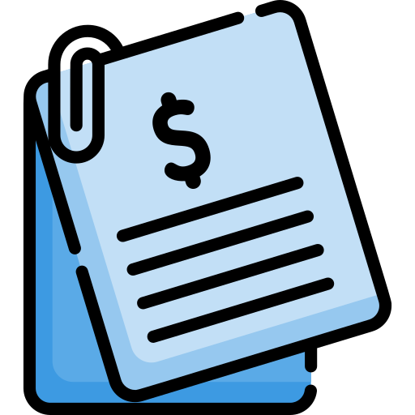

<h1 align="center">Bill of Materials</h1>

  

This document lists the components used in the Gesture-Controlled Robotic Arm project.

## 📂 Electrical BOM
A detailed list of all electronic components, including ICs, resistors, capacitors, connectors, and other necessary parts for the electrical design.

[Electrical](./Bill_of_Materials_Electrical.pdf)

## 📂 Mechanical BOM
A comprehensive list of all mechanical parts, structural components, and fasteners for the arm assembly.

[Mechanical](./Bill_of_Materials_Mechanical.pdf)