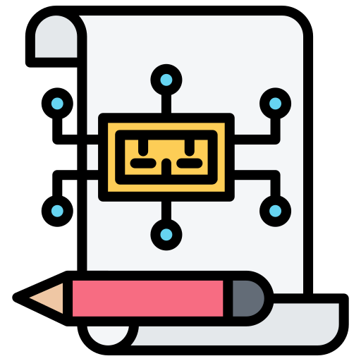
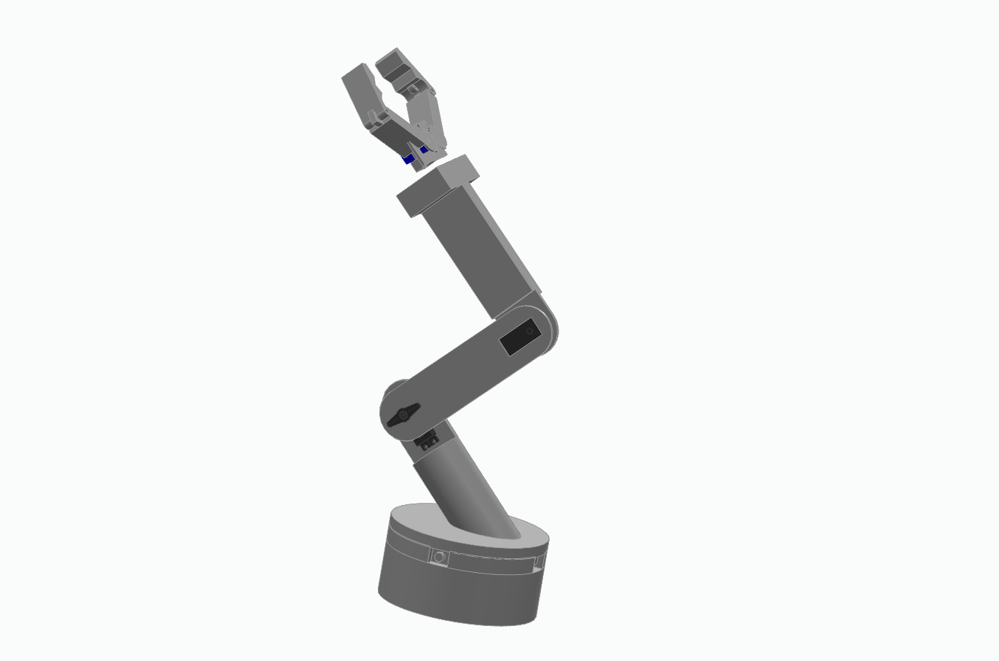
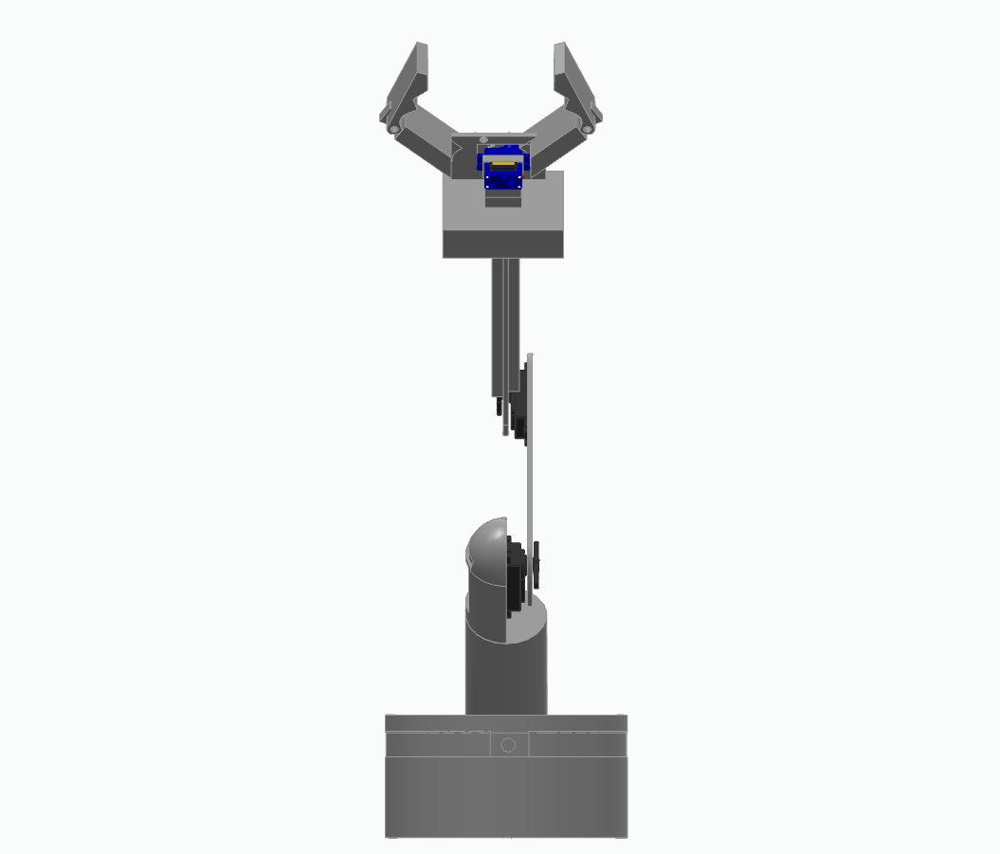
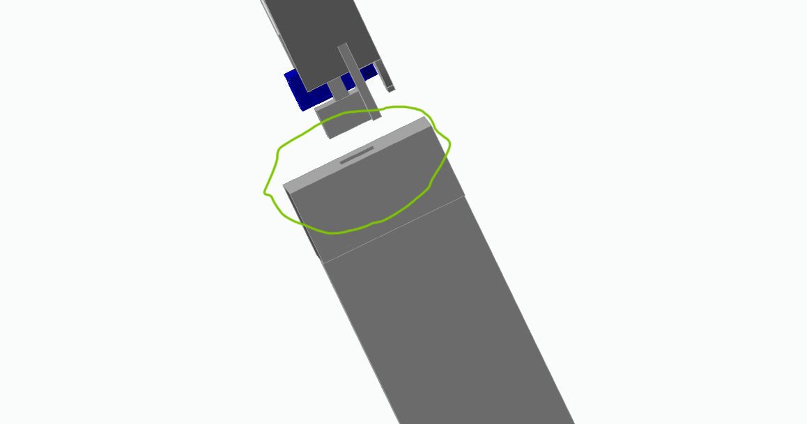

<h1 align="center">Design Folder</h1>

  

## Table of Contents
- [Table of Contents](#table-of-contents)
- [📖 Overview](#-overview)
- [🛠️ Implementation Note](#️-implementation-note)
- [📂 Schematic Files](#-schematic-files)
  - [🔌 1. Power Electronics Schematic](#-1-power-electronics-schematic)
  - [Final PCB for Power Drive](#final-pcb-for-power-drive)
  - [🖐️ 2. Embedded System Schematic](#️-2-embedded-system-schematic)
  - [Final PCB for Glove Control](#final-pcb-for-glove-control)
- [🛠️ Wiring Instructions](#️-wiring-instructions)
- [🦿 Mechanical Design Overview](#-mechanical-design-overview)
  - [📂 Mechanical Design Files](#-mechanical-design-files)
  - [🖼️ Final Mechanical Build](#️-final-mechanical-build)
  - [🛠️ Assembly Instructions](#️-assembly-instructions)
  - [⚠️ Mechanical Handling Notes](#️-mechanical-handling-notes)
    - [Image of the Feature Excluded:](#image-of-the-feature-excluded)
- [🔗 Useful Links](#-useful-links)

## 📖 Overview  

This folder contains three important schematic files related to the design of the Robotic Arm project. Each schematic serves a specific purpose and is crucial for the development and integration of the power electronics and embedded systems.
> 📄 All schematics are provided in PDF format for easy viewing and printing.
> All the voltages mentioned are in DC unless specified.
> Designed and documented by **IoRT Club** - Embedded & Power Crew.

---

## 🛠️ Implementation Note

You can implement the electronics in two ways:

- **Custom PCB**:  
  Build a dedicated PCB by referring to the provided schematics for a more compact and reliable design.

  You can design the PCB using free tools such as:
  - [KiCad](https://www.kicad.org/) — Open-source, highly customizable PCB design software.
  - [EasyEDA](https://easyeda.com/) — Browser-based and beginner-friendly PCB design platform.

  > **Note**: Both tools are free to use (with some limitations).    
  After completing your design, export the files in **Gerber format** and submit them to a PCB fabrication vendor for manufacturing.

- **Perfboard / Breadboard**:  
  Alternatively, for prototyping or quick builds, you can assemble the circuits manually on a perfboard by carefully following the schematic connections. 
  Using a perfboard is recommended if manufacturing a custom PCB is not feasible or practical.

> **Note**: Ensure proper wire management and soldering practices if you choose the perfboard method to maintain signal integrity and minimize errors.

---

## 📂 Schematic Files

### 🔌 1. Power Electronics Schematic 

- **File Name**: [Schematic_Power-Drive-Gesture-Controlled-Robotic-Arm_2025-04-26](Schematic_Power-Drive-Gesture-Controlled-Robotic-Arm_2025-04-26.pdf)
- **Description**: This schematic implements the power drive for the robotic arm, including the configuration for servos and motors. It outlines how power is managed and distributed to ensure optimal performance of the robotic arm's movements.
  - Handles the actuation part of the robotic arm including control for servos and a NEMA17 stepper motor.
  - Features motor driving using DRV8825 for stepper control and PCA9685 for multi-servo PWM output.
  - Power management done using LM2596 buck converter and dual LM7805 regulators.
- **Key ICs**:
  - ESP32-WROOM32
  - DRV8825 Stepper Motor Driver
  - PCA9685 16-Channel PWM Driver
  - LM2596 Adjustable Buck Converter
  - LM7805 Voltage Regulators
- **Notes**:
  - Main voltage input via XT60 connector (e.g., 12V supply).
  - Separate regulation for logic and motor sections to avoid noise.

> ⚠️ **Power Safety Warning**  
> 
> The Power Drive system is designed to operate using a **12V DC SMPS (Switched-Mode Power Supply)** rated at a minimum of **2.5A**.  
> 
> Please exercise extreme caution while handling the power system:
> - Ensure the SMPS is properly rated and from a reputable manufacturer.
> - Always verify polarity before connecting the supply to the circuit.
> - Never work on the circuit while the SMPS is powered ON.
> - Use appropriate fuses or protection circuits if possible.
> 
> 🔥 Mishandling the power supply can cause **serious damage to components** or **pose a fire hazard**.  
> Double-check all connections before powering the system.

### Final PCB for Power Drive

<!-- PCB for Power Drive -->

### 🖐️ 2. Embedded System Schematic 

- **File Name**: [Schematic_Glove-Gesture-Controlled-Robotic-Arm_2025-04-26](Schematic_Glove-Gesture-Controlled-Robotic-Arm_2025-04-26.pdf)
- **Description**: This schematic details the data acquisition part of the robotic arm, which captures user gestures through a glove interface. It is designed to facilitate communication between the user's gestures and the robotic arm's movements.
  - Captures the user gestures via an ESP32-WROOM32 module, two MPU6050 IMUs, and flex sensors.
  - Features voltage regulation using AMS1117 (3.3V) and LM7805 (5V) to power sensors reliably.
  - Includes TTP223 touch sensors for auxiliary control inputs.
- **Key ICs**:
  - ESP32-WROOM32
  - AMS1117-3.3 Voltage Regulator
  - LM7805 Voltage Regulator
  - Two MPU6050 Modules
  - Flex Sensors
- **Notes**:
  - Operates at 3.3V logic levels.
  - Input supply is 9V regulated down. Ensure the input provided is between 6V to 12V
  - >⚠️ **Note**: The touch sensor feature has been omitted from the current version and is planned for a future release

### Final PCB for Glove Control

<!-- Final GLove Control PCB -->

---

## 🛠️ Wiring Instructions
- Ensure the all components are upto the rating as mentioned in the [BOM](Bill_of_Materials_Electrical.pdf)
- Make sure the pinout of your component matches the one provided in the schematic
- If a perfboard based design if being followed ensure that each voltage levels have different rails (think of it as a path for the current), the ground can occupy a single common rail.
-  [🔌 1. Power Electronics Schematic ](#-1-power-electronics-schematic) — 
   -  ESP32-WROOM32:
         - GPIO Pins to control servos via PCA9685.
         - SDA (GPIO21) → SDA of PCA9685
         - SCL (GPIO22) → SCL of PCA9685 

   - PCA 9685
      - Set the buck converter(LM2596) to output a steady voltage of 5.5V
      - The servos are connected to channel 0,1 and 2

   - DRV8825 (Stepper Motor Driver):  
       - DIR (Direction) and STEP pins connected to GPIOs of ESP32 for motor control.
       - Enable pin if required can be connected to a GPIO pin

- [🖐️ 2. Embedded System Schematic ](#️-2-embedded-system-schematic) —
  - MPU6050 IMUs:
    - SDA (GPIO21) and SCL (GPIO22) for I2C communication.
    - One of the MPU6050 IMU has its ADD pin (pin no 7) pulled high to _+3.3V_ this so that both the MPU sensors have unique I2C addresses.

  - Flex Sensors and TTP223 Touch Sensors:
    - Flex sensors and touch sensors connected to the ESP32 analog or digital inputs based on your design.

--- 

## 🦿 Mechanical Design Overview

This section covers the mechanical design aspects of the **Gesture-Controlled Robotic Arm**.  
The structure is designed to be lightweight, modular, and easily reproducible using commonly available materials.

---

### 📂 Mechanical Design Files

- **Formats**: `.step`, `.asm`

---

### 🖼️ Final Mechanical Build

---

### 🛠️ Assembly Instructions

- Begin assembly from the **base** to the **end effector**.
- Secure each joint firmly using M3 bolts and lock nuts.
- Align servos at their neutral (90°) or zero position (0°) position before fixing.
- Use threadlock on critical load-bearing screws.
- Maintain consistent spacing and ensure no binding during motion.
- For the base, use weight balancing if necessary (placing a metal plate or any apporpriate weights).

---

### ⚠️ Mechanical Handling Notes

> ⚠️ **Important:**  
>  
> - Avoid over-tightening bolts to prevent cracking plastic or aluminum parts.
> - Always test free movement manually before powering the arm.
> - Use washers where necessary to distribute load stress.
> - Use lubricant for ball bearings if necessary.
- Feature Exclusion: The integration of a 4th link between the end effector and the robotic arm, which would provide enhanced dexterity and range of motion, has not been implemented in this version of the design. This feature is part of our future plans and will be incorporated in a subsequent update to further improve the system's functionality.

#### Image of the Feature Excluded:
- The servo will be placed in the final design but wont be utilised for movement. _The feature has been circled in green_

> ⚠️ **Warning** **3D Printing Tolerance Issues:** Significant tolerance issues were encountered during the 3D printing and mechanical assembly of the robotic arm. Misalignments, incorrect fits, and dimensional inaccuracies affected the integration of multiple components. It is **strongly recommended** to carefully inspect, measure, and, if necessary, modify the 3D models before printing. Pay special attention to part interfaces, mounting holes, and moving joints to ensure a smooth assembly and functional operation.

---

## 🔗 Useful Links
- [PCA9685 Datasheet and Pinout](https://www.espboards.dev/sensors/pca9685/#specs)
- [DRV8825 Datasheet and Pinout](https://www.makerguides.com/drv8825-stepper-motor-driver-arduino-tutorial/)
- [ESP32 Datasheet and Pinout](https://randomnerdtutorials.com/getting-started-with-esp32/)
- [MPU6050 Datasheet and Pinout](https://lastminuteengineers.com/mpu6050-accel-gyro-arduino-tutorial/)
- [KiCAD Basics](https://www.youtube.com/playlist?list=PLn6004q9oeqGl91KifK6xHGuqvXGb374G)
- [Soldering Tutorial — 1](https://www.instructables.com/A-Comprehensive-Guide-to-Soldering-Techniques-Tool/)
- [Soldering Tutorial — 2](https://www.sciencebuddies.org/science-fair-projects/references/how-to-solder)
- [MG995 3D MODEL](https://grabcad.com/library/mg995-servo-3)
- [SG90 3D MODEL](https://grabcad.com/library/sg90-micro-servo-9g-tower-pro-1)
- [Robotic Arm Collection](https://grabcad.com/library?page=1&time=all_time&query=robotic%20arm)
  - Please note that the design available for the robotic arm are provided for reference purposes only. While they offer valuable and powerful insights, our design may differ in complexity and features, as we have opted for a simpler, more modular approach.
  
---